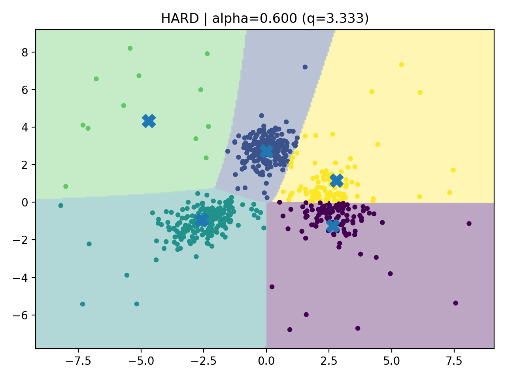
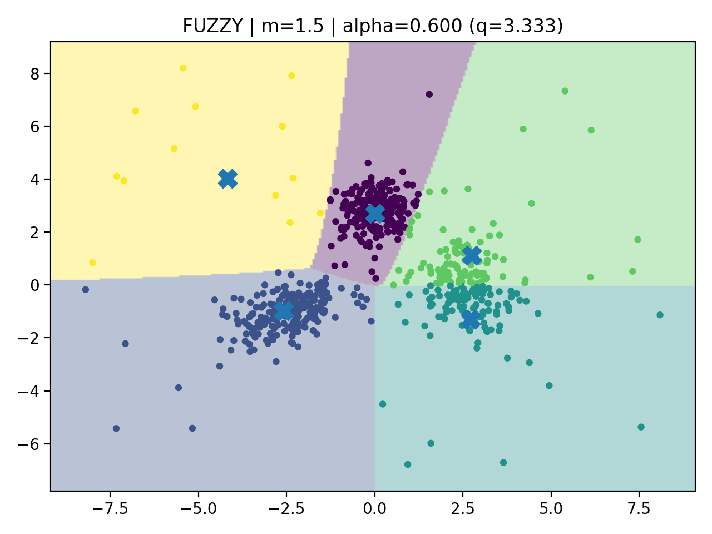

# $\Phi_\alpha$-Clustering: KMeans and Fuzzy C-Means under $\Phi_\alpha$-Geometry

This repository implements **$\Phi_\alpha$-KMeans** and **$\Phi_\alpha$-FCM**, two extensions of classical clustering algorithms based on a **non-Euclidean geometry induced by a signed power transformation**.

---

## Overview

We consider the transformation:

$\Phi_\alpha(x) = \mathrm{sign}(x) |x|^\alpha, \ \alpha >0$

which induces the $\Phi_\alpha$-distance (when $\alpha \geq 1$) or quasi-distance (when $\alpha\in$ (0,1)):

$d_{\Phi_\alpha}(x, y) = \left\|\Phi_\alpha(x) - \Phi_\alpha(y)\right\|^{1/\alpha}$

This deformation modifies the geometry of the data space, allowing more flexibility than standard Euclidean clustering.

---

## Implementations

### 1. $\Phi_\alpha$-KMeans
- File: `PhiKmeans.py`
- Hard clustering method
- Equivalent to KMeans when $\alpha = 1$
- Performs clustering in the transformed space

---

### 2. $\Phi_\alpha$-FCM ($\Phi_\alpha$ Fuzzy C-Means)
- File: `PhiFCM.py`
- Soft clustering with memberships $u_{ik}$
- Controlled by:
  - $\alpha$: geometry parameter
  - $m$: fuzzifier
- Reduces to KMeans when $m \to 1$ and $\alpha=1$

---

## Illustrations

  ###  $\Phi_\alpha$-KMeans (Hard clustering, α = 0.6)  
<p align="center">
  
</p>


  ###  $\Phi_\alpha$-FCM (Fuzzy clustering, m = 1.5, α = 0.6)
<p align="center">
  
</p>

--- 

## Minimal Requirements

- Python >= 3.8
- PyTorch
- NumPy
- Scikit-learn
- SciPy
- Matplotlib (for visualization)

---

## Usage

```python
from phi_kmeans import PhiKMeans
from phi_fcm import PhiFCM

# Example data
# X: torch tensor or numpy array

# $\Phi_\alpha$-KMeans (Hard clustering)
kmeans = PhiKMeans(k=3, alpha=0.6)
kmeans.fit(X)
labels_kmeans = kmeans.labels_

# $\Phi_\alpha$-FCM (Fuzzy clustering)
fcm = PhiFCM(k=3, alpha=0.6, m=1.5)
fcm.fit(X)
labels_fcm = fcm.labels_

# With shared initialization (recommended for comparison)
init_centroids = PhiKMeans.kmeans_pp_init(X, k=3)
kmeans.fit(X, init_centroids)
fcm.fit(X, init_centroids)
